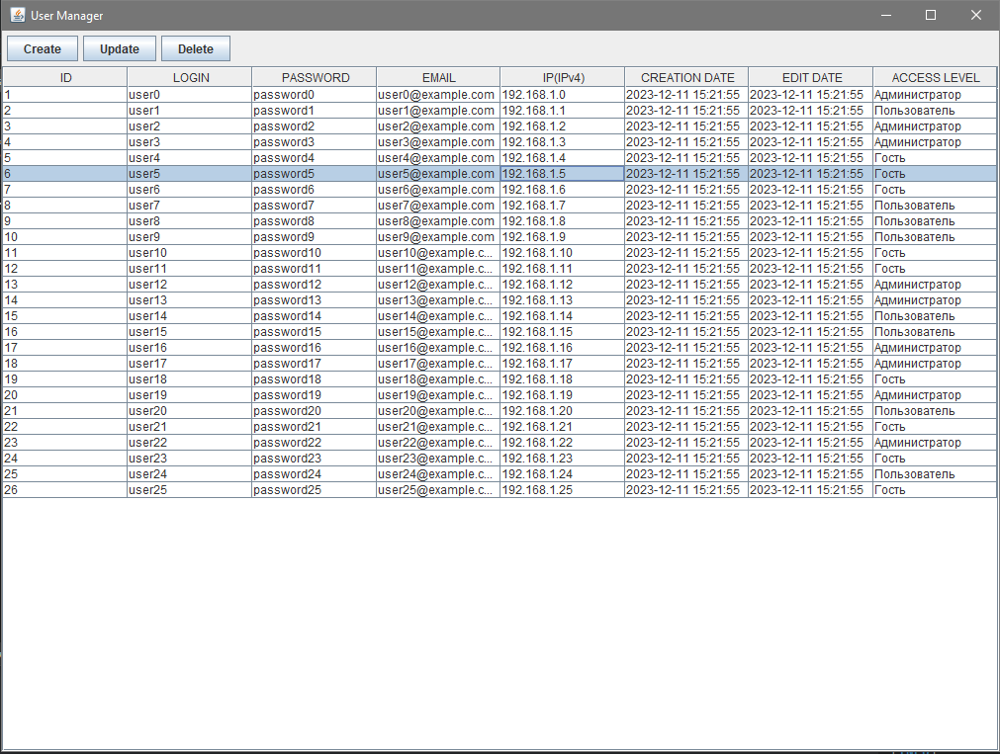
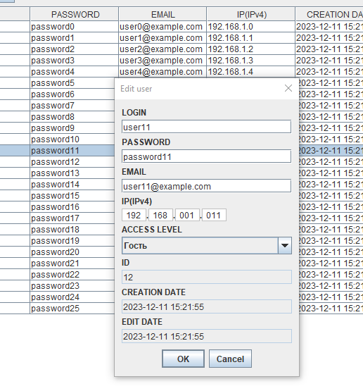
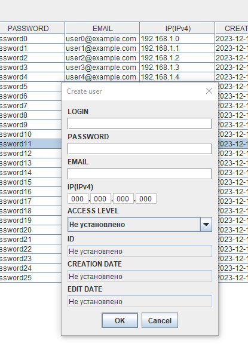

 ### Приложение предназначено для вывода пользовательских данных из БД В GUI и совершения операций CRUD.
 
- Приложение построено на основе MVC архитектуры
- Для GUI приложение использует библиотеку `Swing`.   
- Приложение реализует CRUD функции с данными пользователя
- В качестве репозитория приложение использует `JPARepository`
- Данные пользователя включают в себя (id, login, password, email, ip, creationDate, editDate, accessLevel)
- Для запуска приложение потребуется DB Postgres.  
- Учетные данные для подключения к БД можно настроить в  `application.properties`.
- Создание нового/редактирование существующего/удаление пользователя осуществляется при нажатии соответствующей кнопки в левом верхнем углу окна приложения.  
- Редактирование возможно только при выборе только одного строки пользователя 
- Удаление возможно при выборе нескольких строк пользователей за раз

### В представленной версии:
- При запуске приложения с помощью `ComandLineRunner `формируются 25 демо-пользователей 
- Таблица `users_credentials` для хранения данных пользователя создается в момент запуска и удаляется по завершении работы приложения 

Общий вид GUI  

 

Редактирование существующего пользователя(при нажатии кнопки `Update`)
 
 

Создание нового пользователя(при нажатии кнопки `Create`) 

